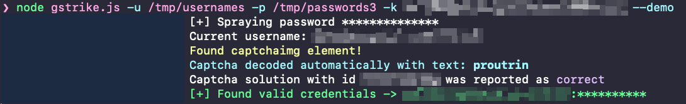

<div align="center" id="top">
  

  &#xa0;

  <!-- <a href="https://gstrike.netlify.app">Demo</a> -->
</div>

<h1 align="center">Gstrike</h1>

<p align="center">
  

  

  

  

  

  

  
</p>

<!-- Status -->

<p align="center">
  <a href="#dart-about">About</a> &#xa0; | &#xa0;
  <a href="#sparkles-features">Features</a> &#xa0; | &#xa0;
  <a href="#rocket-technologies">Technologies</a> &#xa0; | &#xa0;
  <a href="#white_check_mark-requirements">Requirements</a> &#xa0; | &#xa0;
  <a href="#checkered_flag-starting">Starting</a> &#xa0; | &#xa0;
  <a href="#oncoming_taxi-usage">Usage</a> &#xa0; | &#xa0;
  <a href="#high_brightness-extra">Extra</a> &#xa0; | &#xa0;
  <a href="#memo-license">License</a> &#xa0; | &#xa0;
  <a href="https://github.com/y0k4i-1337" target="_blank">Author</a>
</p>

<br>

## :dart: About ##

`Gstrike` is a password spraying tool designed specifically for performing targeted password attacks against Google Workspace accounts, allowing you to efficiently test the strength of user passwords within a Google Workspace environment.

The tool integrates seamlessly with the Puppeteer framework, ensuring a stealthy and efficient spraying process.
`Gstrike` leverages Puppeteer's powerful browser automation capabilities, enabling it to navigate through the Google Workspace login flow, handle reCAPTCHA challenges, and detect successful login attempts. This ensures accurate and reliable results while maintaining the highest level of discretion.

`Gstrike` also provides comprehensive reporting and logging functionalities, allowing you to track the progress of your password spraying campaigns and generate detailed reports. The tool supports customization of parameters such as time between requests and page load waiting time, providing flexibility to adapt to various testing scenarios.

Please note that `Gstrike` is designed for authorized security assessments and penetration testing purposes only. Unauthorized use of this tool is strictly prohibited.

## :sparkles: Features ##

:heavy_check_mark: Perform targeted password spraying attacks against Google Workspace accounts;\
:heavy_check_mark: Seamless integration with the Puppeteer framework for browser automation and discreet operation;\
:heavy_check_mark: Handle reCAPTCHA challenges during the login process;
:heavy_check_mark: Send notifications using Slack webhook.

## :rocket: Technologies ##

The following tools were used in this project:

- [Node.js](https://nodejs.org/en/)
- [Puppeteer](https://pptr.dev/)
- [2Captcha](https://2captcha.com/)

## :white_check_mark: Requirements ##

Before starting :checkered_flag:, you need to have [Git](https://git-scm.com) and [Node](https://nodejs.org/en/) installed.

## :checkered_flag: Starting ##

```bash
# Clone this project
$ git clone https://github.com/y0k4i-1337/gstrike

# Access
$ cd gstrike

# Install dependencies
$ yarn

# Run the project
$ node gstrike.js -u usernames.txt -p passwords.txt -i 10000 -w 2000 -k YOUR_2CAPTCHA_API_KEY -s YOUR_SLACK_WEBHOOK_URL
```

## :oncoming_taxi: Usage ##

```
$ node gstrike.js -h
Usage: gstrike [options]

A password spraying tool designed specifically for performing
targeted password attacks against Google Workspace accounts

Options:
  -V, --version              output the version number
  -u, --usernames <file>     Path to the usernames file
  -p, --passwords <file>     Path to the passwords file
  -w, --wait-time <ms>       Minimum time to wait for page to load in milliseconds (default: 1000)
  -i, --interval <ms>        Interval between login attempts in milliseconds (default: 0)
  -H, --headless             Run in headless mode (default: false)
  -k, --api-key <key>        2Captcha API key
  -s, --slack-webhook <url>  Slack webhook URL
  -o, --output <outputFile>  Specify the output file name (default: "valid_creds.txt")
  --test                     Test bot detection and take screenshot of the results (default: false)
  --demo                     Run in demo mode (do not output passwords to the screen) (default: false)
  --typing-delay <ms>        Delay for typing in milliseconds (default: 100)
  -S, --screenshot           Take screenshot on successful login or on unexpected behaviour (default: false)
  -d, --directory <dir>      Directory to save screenshots when using -S (default: "screenshots")
  -h, --help                 display help for command
```

### Example ###
<div align="center" style="width:70%;" id="running-example">
  
</div>

## :high_brightness: Extra ##

If you need to discover valid accounts in a domain, you can try my other tool: [checkmail](https://github.com/y0k4i-1337/checkmail).


## :memo: License ##

This project is under license from Apache. For more details, see the [LICENSE](LICENSE) file.


Made with :heart: by <a href="https://github.com/y0k4i-1337" target="_blank">y0k4i</a>

&#xa0;

<a href="#top">Back to top</a>
